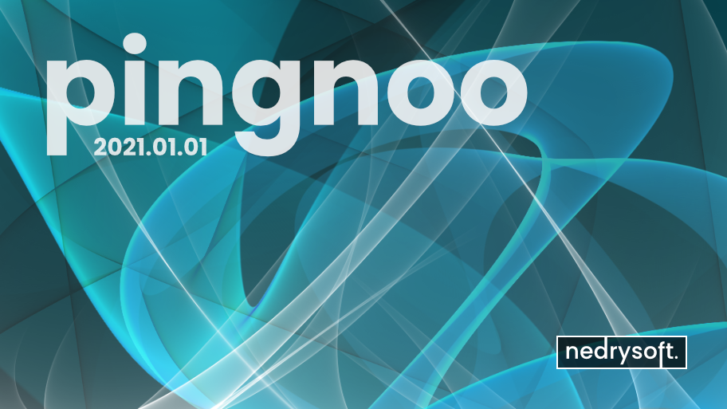

*************
Using Pingnoo
*************

Pingnoo has been designed to be extremely easy to use, the user interface uses the familier Ribbon style and is consistent across platforms, so no matter which operating system it is run under, it will remain familiar to you.

Starting Up
===========

When launched, the application will show a splashscreen which includes information about the application.

.. tip::
	The version numbering system used allows you to quickly see how old your version is.

	It uses the form **YYYY.MM.DD**-<git branch>

	for example, *2021.01.01-develop* tells you that the application was built on the 1st Jan 2021 from the develop branch, the git revision is also displayed in the software so that the source code that was used for this build can be obtained directly.

The User Interface
------------------

.. doc:userinterface.rst
